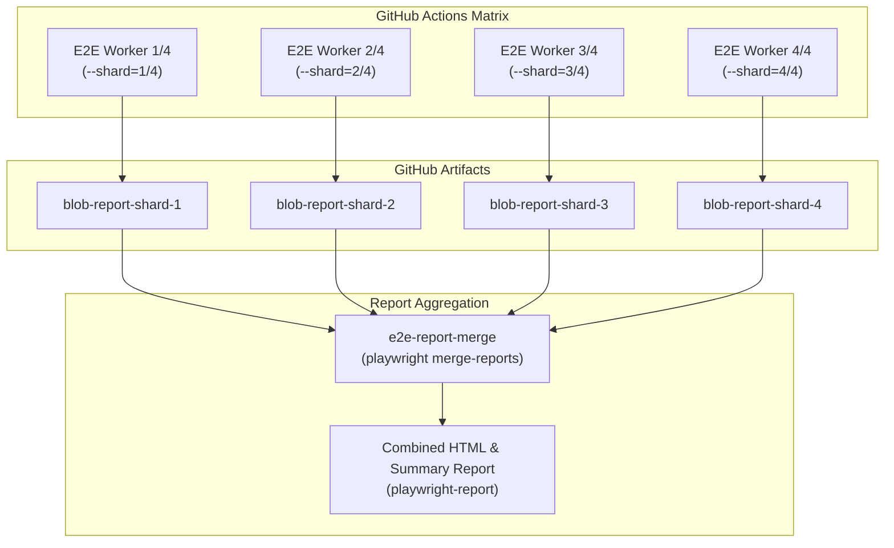

# E2E Test Sharding & Parallel CI Execution

This document details the Playwright End-to-End (E2E) parallel test sharding architecture, report merge aggregation, and flaky triage rerun mechanics for OphirPay CI/CD.

---

## 1. Overview & Objectives

As the OphirPay platform expands (covering smart contracts, payment orchestration, multi-signature approvals, recurring streams, escrow, and governance), the E2E Playwright test suite grows in size and coverage. Running all tests sequentially within a single CI runner leads to long wall-clock build times (25+ minutes).

By **sharding the E2E test suite across 4 parallel matrix workers**, the wall-clock execution time drops dramatically to under 7 minutes, while maintaining deterministic guarantees and comprehensive artifact retention.

---

## 2. Sharding Architecture & Spec Distribution

Playwright provides built-in test partitioning via the `--shard=current/total` flag. In CI, GitHub Actions orchestrates a matrix of workers running against isolated test PostgreSQL databases and production Next.js builds.



### Spec File Partitioning
Tests are evenly distributed across workers deterministically based on spec file paths.
You can inspect the shard distribution locally:

```bash
npm run test:e2e:inspect-shards
# or
node scripts/e2e-sharding.mjs list 4
```

Example 4-way partition output:
```
┌─────────────┬─────────────┬────────────────────────────────────────────────┐
│ Shard Index │ Spec Count  │ Assigned Spec Files                            │
├─────────────┼─────────────┼────────────────────────────────────────────────┤
│ Shard 1     │ 2 file(s)   │ api.spec.ts, multisig.spec.ts                  │
│ Shard 2     │ 2 file(s)   │ contracts.spec.ts, titles.spec.ts              │
│ Shard 3     │ 2 file(s)   │ critical-flows.spec.ts, dashboard.spec.ts      │
│ Shard 4     │ 2 file(s)   │ error-codes.spec.ts, governance.spec.ts        │
└─────────────┴─────────────┴────────────────────────────────────────────────┘
```

---

## 3. Blob Reports & Combined Report Merging

In CI environments, individual shards produce isolated **blob reports** (`blob-report/` zip files) rather than conflicting HTML reports.

1. **Shard Step (`e2e-tests`)**:
   - Each shard runs `npx playwright test --shard=${{ matrix.shardIndex }}/${{ matrix.shardTotal }}`.
   - Configured with `blob` and `list` reporters.
   - Uploads artifact named `blob-report-shard-${{ matrix.shardIndex }}` with `retention-days: 7`.

2. **Merge Step (`e2e-report-merge`)**:
   - Downloads all blob reports matching `blob-report-shard-*` using `actions/download-artifact@v4` with `merge-multiple: true`.
   - Executes `npx playwright merge-reports --reporter=html,list ./all-blob-reports`.
   - Uploads unified `playwright-report/` artifact with `retention-days: 14` for complete test execution history and traces.

---

## 4. Rerun-Only-Failed Mode (Flaky Triage)

When triaging test failures or verifying fixes for flaky tests, running the entire test suite is unnecessary. Playwright provides the `--last-failed` option, which reads the results from the previous test run in `.playwright/.cache` and executes only the failed specs.

### Local Rerun
```bash
npm run test:e2e:failed
# or
node scripts/e2e-sharding.mjs failed-only --project=chromium
```

### Manual CI Triage (GitHub Actions Workflow Dispatch)
Maintainers can trigger the `OphirPay CI/CD` workflow manually from GitHub Actions with custom inputs:
- `failed_only`: Set to `true` to execute only failed test cases.
- `shard_total`: Adjust parallel shard count (default: `4`).
- `project`: Choose target browser project (`chromium`, `firefox`, `mobile-chrome`).

---

## 5. Developer Commands & Scripts Reference

| Script / Command | Purpose |
|---|---|
| `npm run test:e2e` | Runs full Playwright E2E suite locally |
| `npm run test:e2e:ui` | Opens interactive Playwright UI mode |
| `npm run test:e2e:shard` | Runs a specific shard using the CLI helper (`--shard=1/4`) |
| `npm run test:e2e:failed` | Reruns only the tests that failed in the last run |
| `npm run test:e2e:inspect-shards` | Displays table of spec distribution across parallel shards |
| `npm run test:e2e:merge-reports` | Merges blob reports into a single HTML report |
